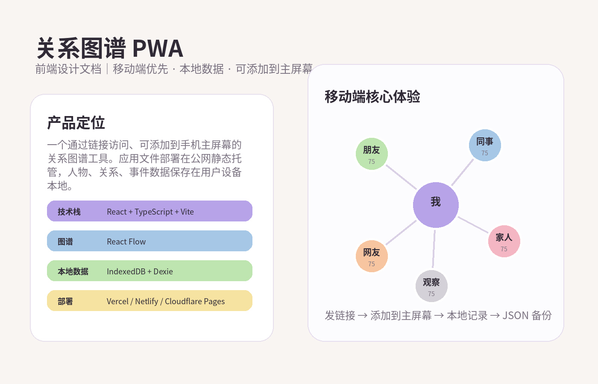
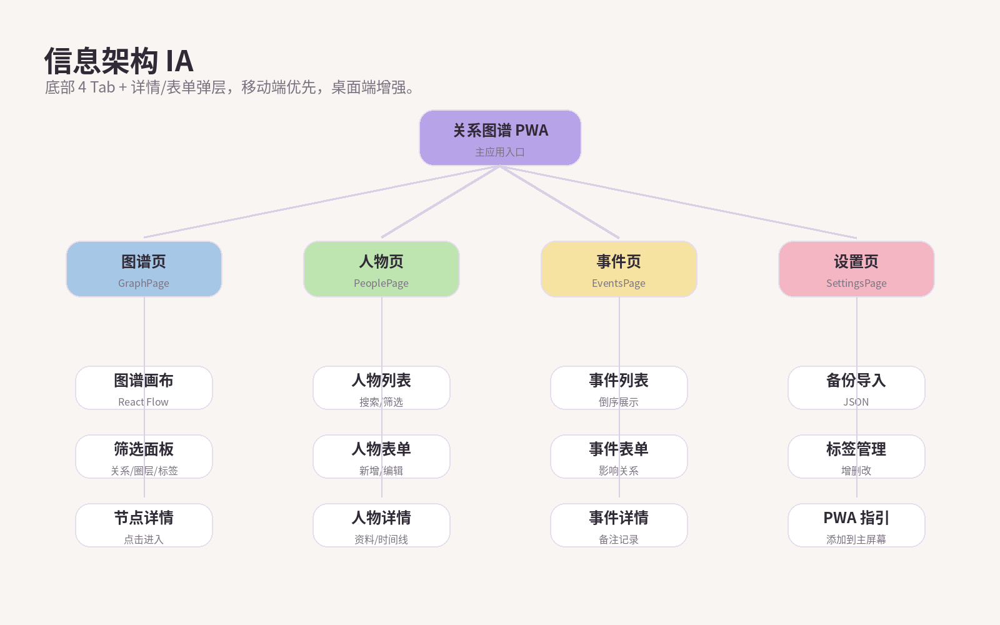
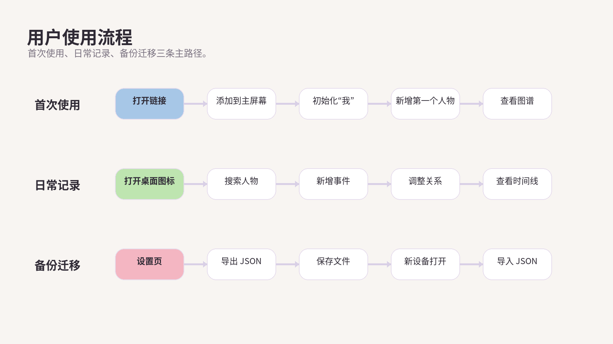
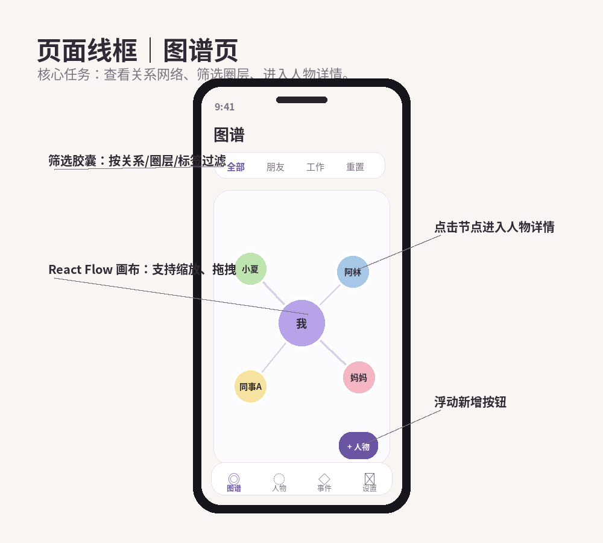
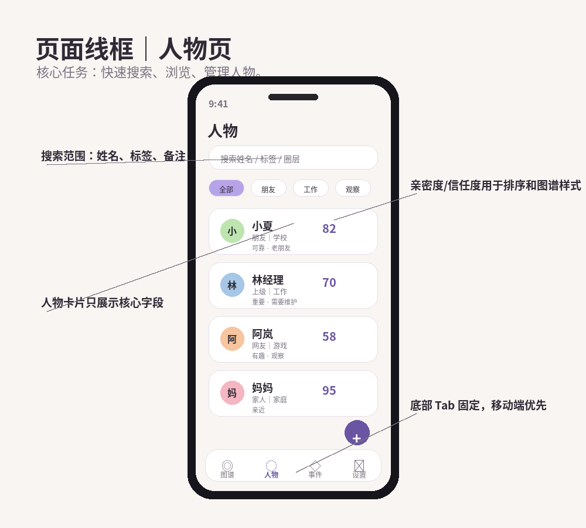
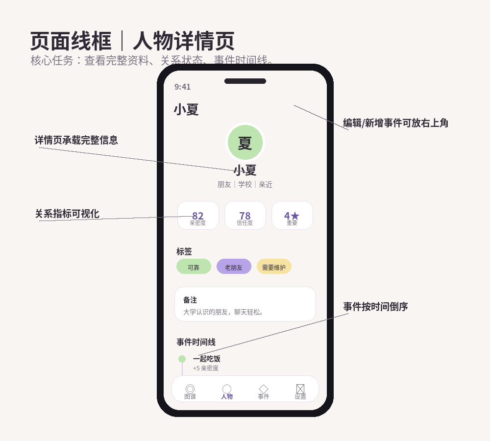
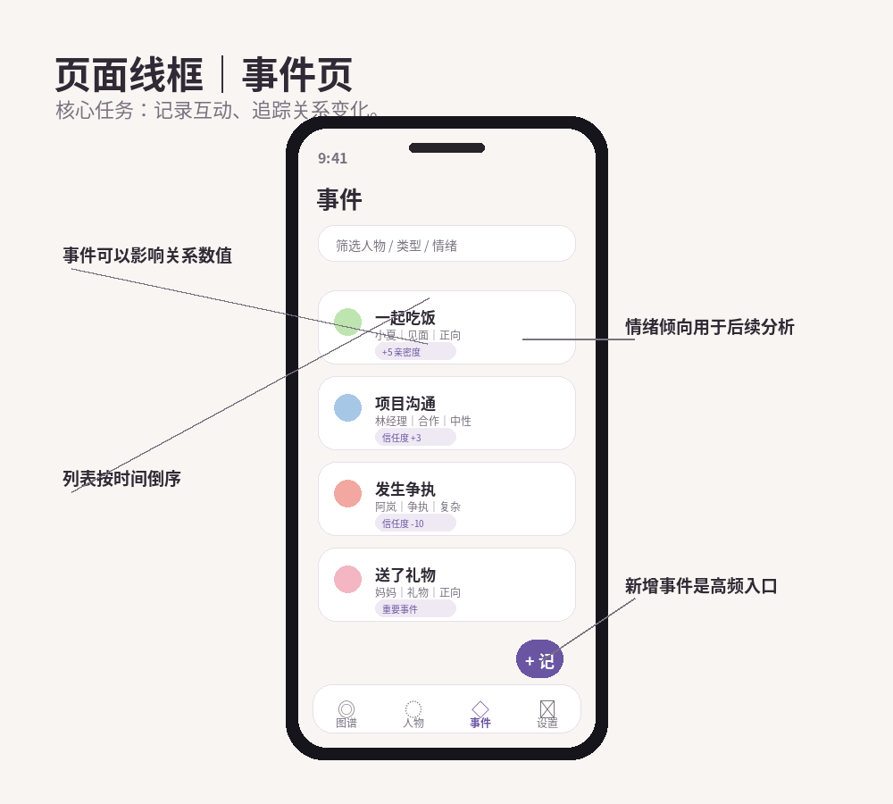
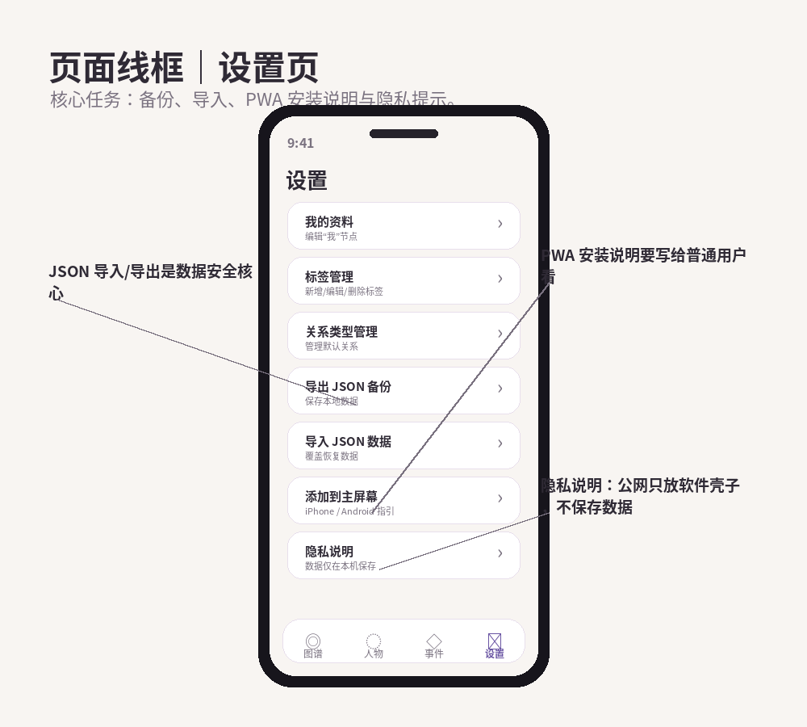
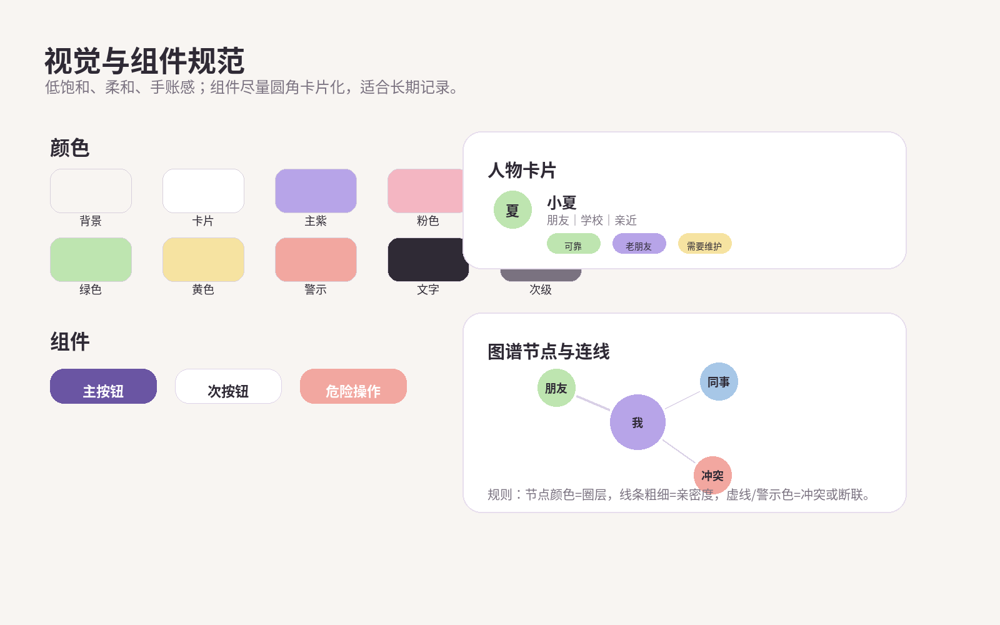
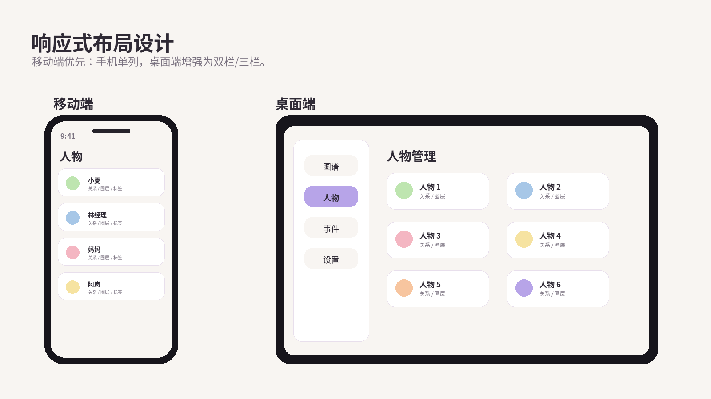

# 关系图谱 PWA｜前端设计文档

## 1. 文档说明

本文档用于指导「关系图谱 PWA」的前端界面设计与实现。

项目不是原生 iOS App，而是一个可以部署到公网静态地址、并添加到手机主屏幕使用的 PWA。前端设计需要兼顾：

- 手机端主体验
- 桌面端开发和管理体验
- 图谱展示
- 本地数据记录
- JSON 备份导入
- 朋友通过链接使用

---

## 2. 设计总览



### 2.1 产品关键词

- 轻量
- 私密
- 柔和
- 手账感
- 图谱感
- 移动端优先
- 本地数据
- 可长期记录

### 2.2 设计目标

1. 用户可以像打开软件一样从主屏幕进入。
2. 新增人物、记录事件、查看图谱路径要短。
3. 页面看起来不像冷冰冰的后台系统。
4. 图谱页负责直观展示，详情页负责承载完整信息。
5. 数据安全入口必须明显，包括导出、导入、清空提示。
6. 首版不追求复杂动效，优先保证清晰和稳定。

---

## 3. 信息架构



### 3.1 主导航

底部 4 个 Tab：

| Tab | 页面 | 说明 |
|---|---|---|
| 图谱 | GraphPage | 关系图谱主视图 |
| 人物 | PeoplePage | 人物列表与管理 |
| 事件 | EventsPage | 互动事件记录 |
| 设置 | SettingsPage | 备份、导入、标签、PWA 指引 |

### 3.2 页面层级

```text
App
├── 图谱页
│   ├── 图谱画布
│   ├── 筛选面板
│   └── 人物详情跳转
├── 人物页
│   ├── 人物列表
│   ├── 新增人物
│   ├── 编辑人物
│   └── 人物详情
├── 事件页
│   ├── 事件列表
│   ├── 新增事件
│   └── 编辑事件
└── 设置页
    ├── 我的资料
    ├── 标签管理
    ├── 关系类型管理
    ├── 数据导出
    ├── 数据导入
    └── 添加到主屏幕说明
```

---

## 4. 用户流程



### 4.1 首次使用流程

```text
打开链接
↓
添加到主屏幕
↓
初始化“我”
↓
新增第一个人物
↓
查看图谱
```

### 4.2 日常记录流程

```text
打开桌面图标
↓
搜索人物
↓
新增事件
↓
调整关系状态
↓
查看人物时间线
```

### 4.3 备份迁移流程

```text
设置页
↓
导出 JSON
↓
保存文件
↓
新设备打开应用
↓
导入 JSON
```

---

## 5. 页面设计

## 5.1 图谱页 GraphPage



### 页面目标

图谱页是应用的核心首页，用于展示“我”和人物之间的关系网络。

### 页面结构

```text
顶部标题
↓
筛选胶囊
↓
React Flow 图谱画布
↓
新增人物浮动按钮
↓
底部导航
```

### 核心元素

| 元素 | 说明 |
|---|---|
| 中心节点“我” | 默认居中，不可删除 |
| 人物节点 | 展示人物姓名、关系类型、亲密度 |
| 关系线 | 连接“我”和人物 |
| 筛选胶囊 | 按关系、圈层、标签过滤 |
| 新增按钮 | 快速新增人物 |
| 重置视图 | 画布回到默认缩放和位置 |

### 视觉规则

| 数据 | 视觉表现 |
|---|---|
| 圈层 | 节点颜色 |
| 亲密度 | 连线粗细 |
| 关系状态 | 线条样式 |
| 重要程度 | 节点外圈高亮 |
| 断联 | 节点低透明度 |
| 冲突 | 警示色或虚线 |

### 交互规则

| 操作 | 结果 |
|---|---|
| 点击人物节点 | 进入人物详情 |
| 点击“我”节点 | 进入我的资料 |
| 拖拽画布 | 平移图谱 |
| 双指缩放 | 缩放图谱 |
| 点击筛选 | 展开筛选面板 |
| 点击新增 | 打开新增人物表单 |

---

## 5.2 人物页 PeoplePage



### 页面目标

人物页用于快速管理所有人物，是日常编辑最频繁的页面。

### 页面结构

```text
顶部标题
↓
搜索框
↓
筛选胶囊
↓
人物卡片列表
↓
新增按钮
↓
底部导航
```

### 人物卡片字段

| 字段 | 是否展示 |
|---|---|
| 头像 / 首字母 | 展示 |
| 姓名 | 展示 |
| 关系类型 | 展示 |
| 圈层 | 展示 |
| 亲密度 | 展示 |
| 标签 | 展示前 2-3 个 |
| 最近互动时间 | 可选展示 |

### 交互规则

| 操作 | 结果 |
|---|---|
| 点击卡片 | 进入人物详情 |
| 点击新增 | 打开人物表单 |
| 搜索关键词 | 实时过滤 |
| 点击筛选 | 按关系/圈层/标签过滤 |
| 长按卡片 | 可选：快捷编辑/删除 |

---

## 5.3 人物详情页 PersonDetailPage



### 页面目标

人物详情页承载单个人物的完整资料、关系状态和事件时间线。

### 页面结构

```text
顶部人物信息
↓
关系指标卡片
↓
标签
↓
备注
↓
事件时间线
↓
编辑 / 新增事件入口
```

### 核心区块

| 区块 | 内容 |
|---|---|
| 基础信息 | 头像、姓名、昵称、关系类型、圈层 |
| 关系指标 | 亲密度、信任度、重要程度 |
| 状态信息 | 关系状态、情绪倾向 |
| 标签 | 人物特征 |
| 备注 | 自由记录 |
| 时间线 | 与该人物相关的事件 |

### 交互规则

| 操作 | 结果 |
|---|---|
| 点击编辑 | 打开人物表单 |
| 点击新增事件 | 打开事件表单 |
| 点击事件 | 查看或编辑事件 |
| 删除人物 | 二次确认 |

---

## 5.4 事件页 EventsPage



### 页面目标

事件页用于记录和回顾与人物发生过的关键互动。

### 页面结构

```text
顶部标题
↓
筛选栏
↓
事件列表
↓
新增事件按钮
↓
底部导航
```

### 事件卡片字段

| 字段 | 说明 |
|---|---|
| 事件标题 | 必填 |
| 关联人物 | 必填 |
| 事件类型 | 聊天、见面、争执、礼物等 |
| 情绪倾向 | 正向、中性、负向、复杂 |
| 关系影响 | 亲密度/信任度变化 |
| 日期 | 事件日期 |

### 交互规则

| 操作 | 结果 |
|---|---|
| 点击事件 | 进入事件详情 / 编辑 |
| 点击新增 | 打开事件表单 |
| 筛选人物 | 只看某人的事件 |
| 筛选类型 | 只看某类事件 |

---

## 5.5 设置页 SettingsPage



### 页面目标

设置页负责数据安全、管理配置和 PWA 使用说明。

### 页面入口

| 入口 | 说明 |
|---|---|
| 我的资料 | 编辑“我”节点 |
| 标签管理 | 管理标签 |
| 关系类型管理 | 管理默认关系 |
| 导出 JSON 备份 | 保存本地数据 |
| 导入 JSON 数据 | 恢复或迁移数据 |
| 添加到主屏幕 | 给用户安装说明 |
| 隐私说明 | 解释数据只保存在本机 |

### 重点提示

设置页必须明确告诉用户：

```text
本应用数据保存在当前设备本地。更换设备、清理浏览器缓存或删除网站数据可能导致数据丢失。建议定期导出 JSON 备份。
```

---

## 6. 视觉与组件规范



### 6.1 色彩原则

整体采用低饱和、柔和色彩，避免强烈后台工具感。

| 用途 | 色彩建议 |
|---|---|
| 背景 | 米白 / 浅灰 |
| 主色 | 柔和紫 |
| 朋友 | 柔和绿 |
| 家人 | 柔和粉 |
| 工作 | 柔和蓝 |
| 重要 | 浅金 |
| 冲突 | 柔和红 |
| 断联 | 灰色 |

### 6.2 组件风格

| 组件 | 规则 |
|---|---|
| 卡片 | 圆角、轻阴影、留白充足 |
| 按钮 | 主按钮高识别，危险按钮用红色系 |
| 标签 | 胶囊样式 |
| 输入框 | 圆角、浅边框 |
| 底部导航 | 固定底部，图标 + 文案 |
| 空状态 | 插画/提示文案 + 操作按钮 |

### 6.3 字体层级

| 层级 | 大小建议 |
|---|---|
| 页面标题 | 24-28px |
| 卡片标题 | 16-18px |
| 正文 | 14-16px |
| 辅助信息 | 12-13px |
| 标签 | 11-12px |

---

## 7. 响应式设计



### 7.1 移动端

移动端是主体验，应优先保证：

- 单列布局
- 底部导航
- 表单易填写
- 图谱可拖拽缩放
- 关键按钮易点击
- 键盘不遮挡保存按钮

### 7.2 桌面端

桌面端用于开发调试和重度编辑，可增强为：

- 侧边导航
- 双列人物卡片
- 更大的图谱画布
- 详情页右侧抽屉
- 表格化事件列表

### 7.3 断点建议

| 断点 | 布局 |
|---|---|
| < 640px | 手机单列 |
| 640px - 1024px | 平板单列/双列 |
| > 1024px | 桌面多列 |

---

## 8. 表单设计

### 8.1 人物表单

字段分组：

```text
基础信息
关系信息
标签与联系方式
备注
```

基础信息：

- 姓名
- 昵称
- 头像
- 圈层

关系信息：

- 关系类型
- 关系状态
- 亲密度
- 信任度
- 重要程度
- 情绪倾向

标签与联系方式：

- 标签
- 联系方式
- 生日
- 认识日期

备注：

- 长文本

### 8.2 事件表单

字段分组：

```text
事件信息
关系影响
备注
```

事件信息：

- 标题
- 关联人物
- 事件类型
- 事件日期
- 情绪倾向

关系影响：

- 是否影响关系
- 亲密度变化
- 信任度变化

备注：

- 长文本

---

## 9. 空状态与错误状态

### 9.1 空状态文案

| 页面 | 文案 | 按钮 |
|---|---|---|
| 图谱页 | 还没有添加人物，先记录第一个人吧。 | 添加人物 |
| 人物页 | 你的人物关系图谱还是空的。 | 添加人物 |
| 事件页 | 暂无事件记录。 | 记录一件事 |
| 标签页 | 暂无标签。 | 新增标签 |

### 9.2 错误提示

| 场景 | 文案 |
|---|---|
| 姓名为空 | 请输入人物姓名 |
| 事件标题为空 | 请输入事件标题 |
| 导入失败 | 文件格式错误，无法导入 |
| 导出失败 | 导出失败，请稍后重试 |
| 清空确认 | 此操作会删除所有本地数据，建议先导出备份。是否继续？ |

---

## 10. 前端组件拆分建议

```text
src/components/
├── layout/
│   ├── AppLayout.tsx
│   ├── BottomTabBar.tsx
│   └── PageHeader.tsx
├── common/
│   ├── Button.tsx
│   ├── Card.tsx
│   ├── Tag.tsx
│   ├── EmptyState.tsx
│   ├── ConfirmDialog.tsx
│   └── SearchInput.tsx
├── graph/
│   ├── GraphCanvas.tsx
│   ├── PersonNode.tsx
│   ├── SelfNode.tsx
│   └── RelationshipEdge.tsx
└── form/
    ├── PersonForm.tsx
    ├── EventForm.tsx
    └── TagSelector.tsx
```

---

## 11. 给 Codex 的前端设计提示词

```text
请根据 docs/frontend_design.md 中的前端设计方案，实现关系图谱 PWA 的前端界面。

要求：
1. 移动端优先。
2. 使用 React + TypeScript + Tailwind CSS。
3. 页面包含图谱、人物、事件、设置四个底部 Tab。
4. UI 风格低饱和、柔和、圆角卡片化。
5. 图谱页使用 React Flow。
6. 人物页使用卡片列表。
7. 人物详情页展示关系指标和事件时间线。
8. 设置页必须包含 JSON 导出/导入和添加到主屏幕说明。
9. 所有危险操作必须二次确认。
10. 不接入后端，不上传用户数据。
11. 优先保证移动端显示效果。
```

---

## 12. 前端验收标准

| 编号 | 验收项 | 标准 |
|---|---|---|
| 1 | 移动端布局 | iPhone 宽度下无横向溢出 |
| 2 | 底部导航 | 4 个 Tab 可正常切换 |
| 3 | 图谱页 | 能展示中心节点、人物节点和连线 |
| 4 | 人物页 | 卡片信息清晰 |
| 5 | 人物详情 | 指标、标签、备注、时间线完整 |
| 6 | 事件页 | 事件列表清晰 |
| 7 | 设置页 | 备份、导入、PWA 指引明确 |
| 8 | 视觉风格 | 低饱和、圆角、卡片化 |
| 9 | 空状态 | 所有空页面有提示和按钮 |
| 10 | 危险操作 | 有二次确认 |
